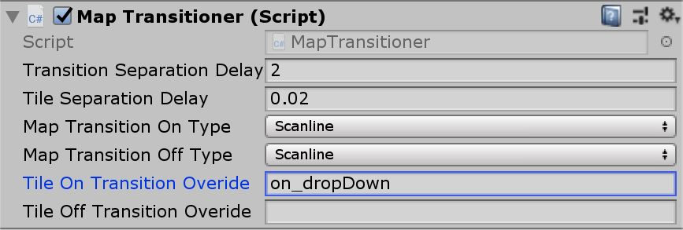
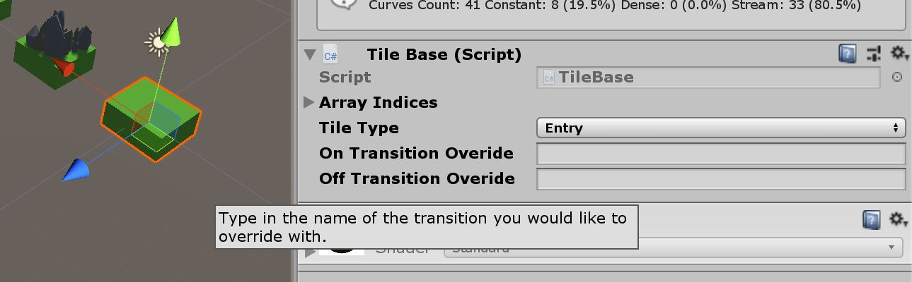
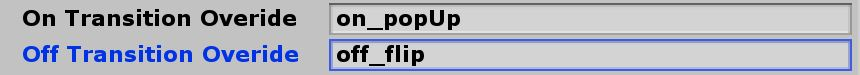
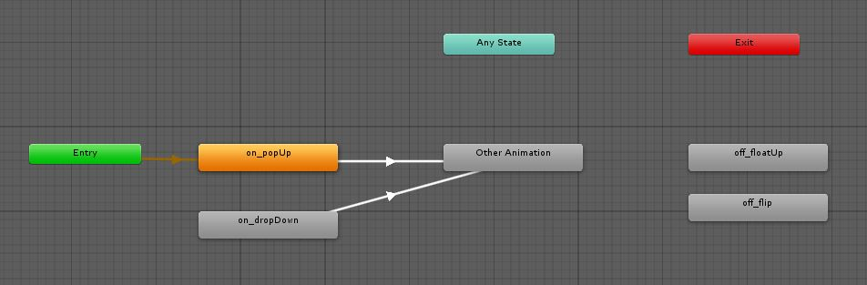
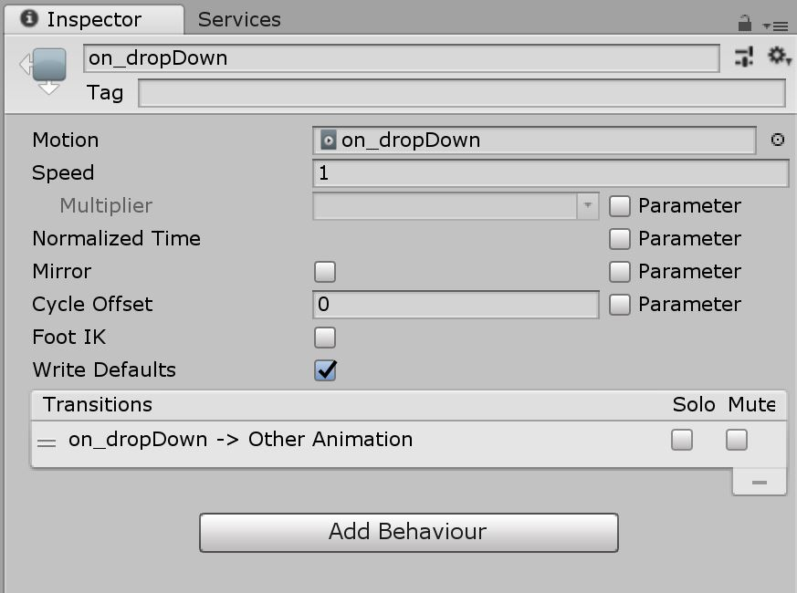

When a map transition is called, the MapTransitioner class takes the data array and parses it into a number of fields for access during the levels play.
These fields are stored in the MapData class.

# GameController Class #
This should be attached as a script component on a GameObject named `Game Ctrl` within the scene.
It can be accessed with the following code:  

// create reference to the game controller object (this is an expensive operation and should only be done once (in startup)  
`GameObject gameController = GameObject.Find("Game Ctrl");`  
// create a reference to the script component on the GameController object  
`GameController gameControllerScript = (MapTransitioner) gameController.GetComponent(typeof(GameController));`  

