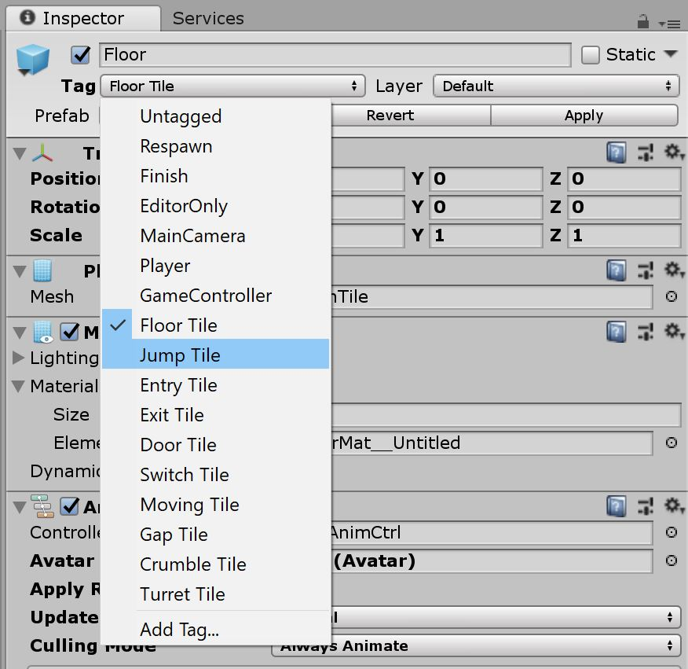
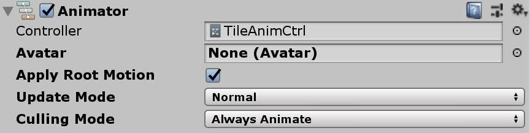

># Please Note: #
>## Currently, these settings are only tested for the scanline transition type in MapTransition CTRL ##

# Basic Tile Setup #

## TileBase Class ##
Each Tile in a scene must utilise the TileBase class.
Alternatively, it can use a script which inherits from the TileBase.

## Editable Fields in the GUI ##
The TileBase class includes a number of editable fields in the Unity GUI. Many fields titles can be hovered over to see a tooltip description. These fields are made available for customisation and testing without the need to edit the TileBase code.

## Tile Type Tag ##
Each tile must also be tagged with it's tile type. Types that the code will recognise are shown here:

## Animation Controller ##
Each tile must also be given an animation controller. The animation controller must be set to **_Apply Root Motion_**

# Setting Up the Animation Controller #

In the Animation Controller's node editor, _on_ transitions (transitions that cause a tile to appear), must have a name starting with `on_`. This will enable them to be found and utilised by the code.

_off_ transitions (transitions that cause a tile to disappear), must have a name starting with `off_`.

No transition links are necessary to on transitions and off transitions as they are selected with code (In the screenshot below, one on transition is set to the default state and thus has a link anyway, but this is not necessary).

Any other animation clips that should play immediately after an on transition must have a transition link from _every_ on transition.

The names utilised in in the code and referred to in the overrides mentioned below are the editable names at the top of each nodes settings (but these are best left as default to the nodes original name to avoid confusion).

Each node clip must also have **_Write Defaults_** checked.

# Specifying Tile Animation Types to Use #

If left alone, the code will automatically choose which tile transition type to use. If no logic exists yet for your particular type, it will probably randomly selected from those you've made available in the animation controller.

You can, however, specify particular animations to use per tile or for all tiles. This can be done for effect or just for testing purposes.

## Per Tile Type ##

Clicking on the tile in the scene, you can type in the name of the transition you would like it to use in the setting GUI for the TileBase script (in the _Transition Override_ fields)
Type `random` to force a random transition to be chosen.

## Per Scene ##

Clicking on the _MapTransition CTRL_ object in the scene, you can type in the name of the tile transition you would like it to use (in the _Tile Transition Override_ fields). This will overide any tile based setting within the whole scene.
Type `random` to force a random transition to be chosen.

